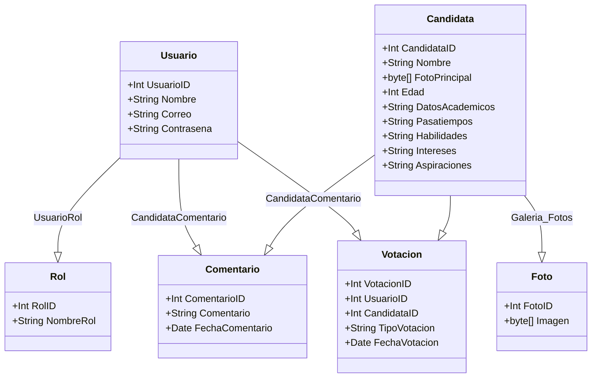

# Diagramas del Proyecto

## Diagrama de clases

```mermaid
classDiagram
    class Rol {
        +Int RolID
        +String NombreRol
    }
    class Usuario {
        +Int UsuarioID
        +String Nombre
        +String Correo
        +String Contrasena
    }
    Usuario --|> Rol : UsuarioRol
    class Candidata {
        +Int CandidataID
        +String Nombre
        +byte[] FotoPrincipal
        +Int Edad
        +String DatosAcademicos
        +String Pasatiempos
        +String Habilidades
        +String Intereses
        +String Aspiraciones
    }
    class Foto {
        +Int FotoID
        +byte[] Imagen
    }
    Candidata --|> Foto : Galeria_Fotos
    class Comentario {
        +Int ComentarioID
        +String Comentario
        +Date FechaComentario
    }
    Usuario --|> Comentario : CandidataComentario
    Candidata --|> Comentario : CandidataComentario
    class Votacion {
        +Int VotacionID
        +Int UsuarioID
        +Int CandidataID
        +String TipoVotacion
        +Date FechaVotacion
    }
    Usuario --|> Votacion
    Candidata --|> Votacion
```

## Diagrama de Modelo Relacional

## Diagrama de casos de uso

