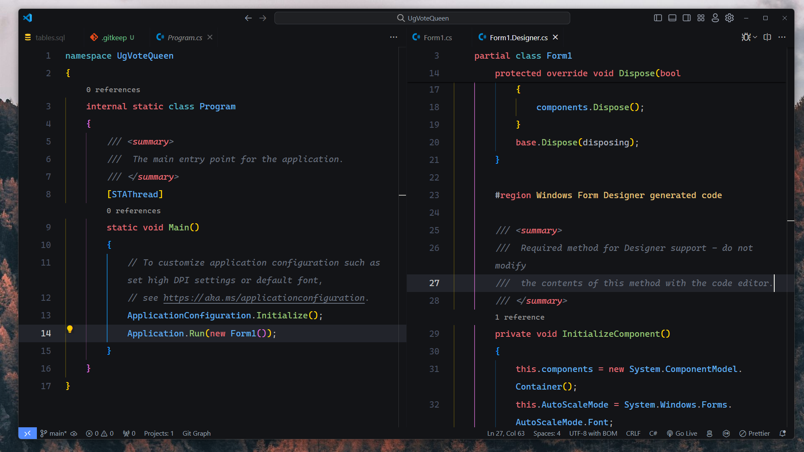

# Init Project



## Share Files And Videos

- [Aprender Git y github](https://www.youtube.com/watch?v=niPExbK8lSw)
- [Github Desktop](https://www.youtube.com/watch?v=TuOQBfhp-r0&t=821s)
- [Aprender DotNet Windows Forms - Ingles](https://www.youtube.com/watch?v=0zLZQesgV5o)
- [Aprender DotNet Windows Forms - Espaniol](https://www.youtube.com/watch?v=JbqBAkpj7T8&t=982s)
- [Aprender DotNet Windows Forms - Espaniol - Entity Framework](https://www.youtube.com/watch?v=JAfg2j8qrsg)
- [Casos de Uso - DrawIO](https://drive.google.com/file/d/1DIQ90IavZdw_TYtvfsRTGQMXg_Ksz_Qs/view?usp=sharing)

## Specification

In Powersheel execute the command:

```sh
Set-ExecutionPolicy RemoteSigned -Scope CurrentUser ​
```

please execute next commands in powersheel

## Install Dependencies

- [Download Visual Studio 2022](https://visualstudio.microsoft.com/es/downloads/)
- [Download Sql Server](https://www.microsoft.com/es-es/sql-server/sql-server-downloads)
- [Download Git](https://git-scm.com/download/win)
- [Download .Net 8 SDK](https://dotnet.microsoft.com/en-us/download/dotnet/8.0)

## Developer Folder

```sh
cd C:\Users\nameUser\Documents\
mkdir Developer
cd Developer
```

## clone repository

```sh
git clone https://github.com/Savecoders/UgVoteQueen.git
cd UgVoteQueen
```

## Config git user

```sh
git config --global user.name "username"
git config --global user.email "email@gmail.com"
```

please using your username and email from github

> [!NOTE]
> It's the most important step from execute this project


## Run Project in normal mode

```sh
dotnet run
```

## Push and pull changes

```sh
git pull --set-upstream origin main
git push --set-upstream origin main
```
